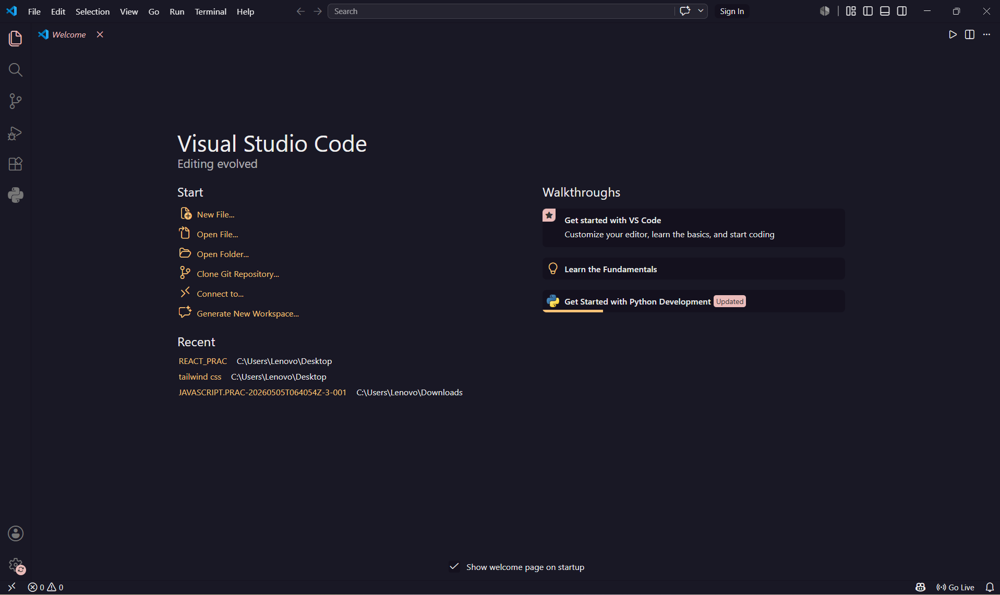
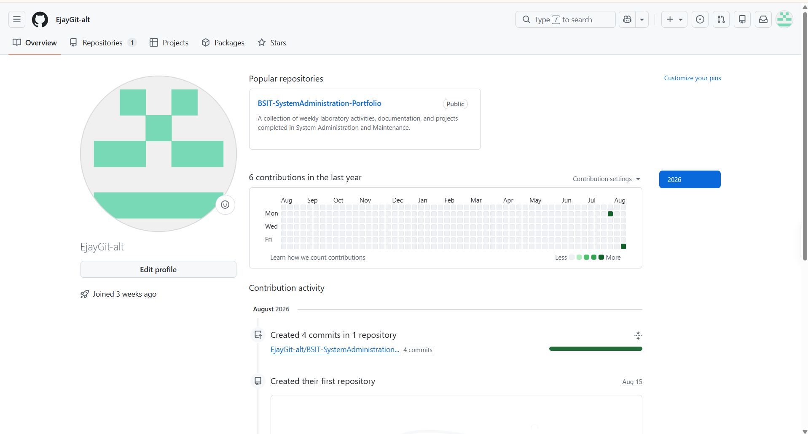
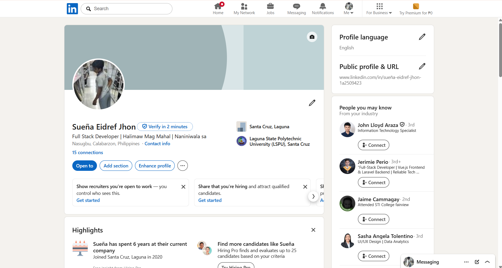

# Week 1 – Building My Professional Environment

## Student Information

| Information | Details                                       |
| ----------- | --------------------------------------------- |
| **Name**    | Eidref Jhon D. Sueña                          |
| **Course**  | Bachelor of Science in Information Technology |
| **Section** | BSIT-4C                                       |
| **Date**    | August 14, 2026                               |

---

## Objectives

* Set up the necessary tools and professional accounts needed for the course.
* Become familiar with Visual Studio Code as a development environment.
* Create and organize a GitHub account for academic activities and future projects.
* Learn the basic use of GitHub repositories for organizing and documenting coursework.
* Establish a professional LinkedIn profile for academic and future career opportunities.
* Practice proper organization and documentation of files and activities.

---

## Software Installed

* ✅ Visual Studio Code

---

## Professional Accounts

* **GitHub:** https://github.com/EjayGit-alt
* **LinkedIn:** https://www.linkedin.com/in/sue%C3%B1a-eidref-jhon-1a2509423/

---

## Installation Screenshots

### Visual Studio Code

---

## Professional Account Screenshots

### GitHub Profile

### LinkedIn Profile

---

## Challenges Encountered

### 1. Setting Up My GitHub Account and Repository

One of the challenges I encountered was becoming familiar with GitHub and understanding how repositories are organized. Since I was still learning how GitHub works, I had to familiarize myself with creating repositories and organizing files and folders properly. I solved this by exploring the basic GitHub features and following the required folder structure for our weekly activities.

### 2. Learning Markdown for the README File

I initially had difficulty understanding how to format the `README.md` file. I had to learn how Markdown uses headings, bullet points, links, tables, and images. After practicing the basic Markdown syntax and checking the preview on GitHub, I was able to organize my documentation properly.

### 3. Organizing My Week 1 Files and Screenshots

Another challenge was organizing the screenshots and files required for Week 1. At first, I was unsure where each screenshot should be placed. I solved this by creating separate `accounts` and `screenshots` folders and giving each image a clear file name so that they could be easily referenced in the README.

---

## Conclusion

During Week 1, I prepared my professional environment by setting up Visual Studio Code and creating my GitHub and LinkedIn accounts. I also became more familiar with GitHub repositories, Markdown documentation, and proper file organization. These activities provided me with the basic tools and skills that I will use throughout the course.

