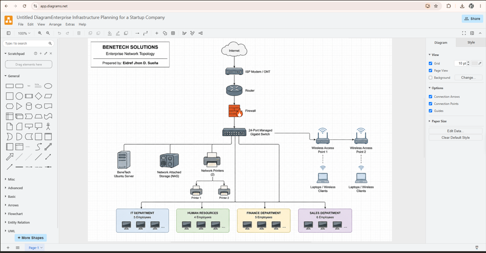

# 🏢 BeneTech Solutions

## Enterprise Infrastructure Planning for a Startup Company

**Course:** ITEP 414 – System Administration and Maintenance
**Week:** 2
**Project Type:** Individual Portfolio Project
**Prepared by:** Eidref Jhon D. Sueña

---

## 📌 Project Overview

This project focuses on planning the initial IT infrastructure of **BeneTech Solutions**, a fictional startup software development company located in Santa Cruz, Laguna, Philippines.

The company has 20 employees distributed across four departments: Information Technology, Human Resources, Finance, and Sales. Since the company is starting without existing computers, servers, networks, internet infrastructure, or security policies, the objective of this project is to design an IT infrastructure that can support its current operations and future growth.

The project covers hardware and software planning, networking equipment, network topology design, system administration roles, infrastructure recommendations, security, backup planning, and technical documentation.

---

## 🎯 Learning Objectives

Through this project, I was able to:

* Analyze the IT requirements of a small startup company.
* Identify appropriate hardware, software, and networking equipment.
* Prepare organized IT inventory documentation.
* Design an enterprise network topology.
* Understand different System Administration roles.
* Develop infrastructure security and backup recommendations.
* Practice technical documentation using Markdown.
* Improve my understanding of infrastructure planning before deployment.

---

## 🏢 Company Scenario

**Company Name:** BeneTech Solutions
**Nature of Business:** Software Development
**Office Location:** Santa Cruz, Laguna, Philippines
**Total Employees:** 20

### Employee Distribution

| Department             | Employees |
| ---------------------- | --------: |
| Information Technology |         5 |
| Human Resources        |         4 |
| Finance                |         5 |
| Sales                  |         6 |
| **Total**              |    **20** |

BeneTech Solutions requires its complete IT infrastructure to be planned from scratch. The proposed infrastructure is designed to provide employees with reliable computing resources, network connectivity, centralized services, data storage, backup, and security.

---

## 🖥️ Hardware Inventory Summary

The proposed hardware infrastructure includes:

| Hardware               | Quantity | Main Purpose                               |
| ---------------------- | -------: | ------------------------------------------ |
| Desktop Computers      |       13 | Primary office workstations                |
| Laptops                |        7 | Mobile workstations for selected employees |
| Server                 |        1 | Centralized company services               |
| Router                 |        1 | Network routing                            |
| Managed Gigabit Switch |        1 | Wired network connectivity                 |
| Network Printers       |        2 | Shared office printing                     |
| UPS                    |        3 | Backup power for critical equipment        |
| Wireless Access Points |        2 | Wireless connectivity                      |
| NAS Storage            |        1 | Centralized storage and backups            |
| External Backup Drives |        2 | Additional data backups                    |
| Monitors               |       20 | Primary and secondary displays             |

The combination of **13 desktops and 7 laptops provides one primary computer for each of the company's 20 employees**.

---

## 💻 Software Inventory Summary

The proposed software environment includes:

| Software           | Purpose                               |
| ------------------ | ------------------------------------- |
| Windows 11 Pro     | Employee workstation operating system |
| Ubuntu Server      | Server operating system               |
| Microsoft 365      | Office productivity and documentation |
| Visual Studio Code | Software development                  |
| Git                | Version control                       |
| GitHub Desktop     | Graphical Git repository management   |
| Oracle VirtualBox  | Virtualization and testing            |
| Google Chrome      | Web browsing and application testing  |
| Microsoft Defender | Endpoint security                     |
| AnyDesk            | Authorized remote technical support   |
| 7-Zip              | File compression and extraction       |

These applications provide BeneTech Solutions with the tools required for productivity, software development, system administration, testing, security, and technical support.

---

## 🌐 Enterprise Network Topology

The proposed network follows this general connection:

**Internet → ISP Modem/ONT → Router → Firewall → 24-Port Managed Gigabit Switch**

The managed switch distributes network connectivity to the company's server, NAS storage, network printers, wireless access points, and four departments.

### Network Diagram


📄 ****

---

## 🛠️ Technologies and Tools Used

The following technologies and tools were used or studied during the project:

* Draw.io / diagrams.net
* Git
* GitHub
* GitHub Desktop
* Visual Studio Code
* Windows 11 Pro
* Ubuntu Server
* VirtualBox
* Microsoft 365
* Networking concepts and equipment
* Markdown documentation

---

## 👨‍💻 System Administration Roles

The project also explored four important IT roles:

### Helpdesk Technician

Provides first-level technical support for employees experiencing hardware, software, account, printer, and basic connectivity problems.

### Network Administrator

Manages routers, switches, wireless networks, network connectivity, performance, and network security configurations.

### Linux System Administrator

Manages Linux servers, user permissions, services, updates, backups, security, and system performance.

### Cloud Administrator

Manages cloud resources such as virtual machines, storage, networking, user access, monitoring, and cloud security.

These professionals work together to maintain reliable, secure, and available IT services within an organization.

---

## 🔐 Infrastructure Recommendations

The proposed infrastructure for BeneTech Solutions includes:

* Reliable business fiber internet connectivity
* Server-grade hardware with redundant storage
* Daily automated backups
* NAS and external backup storage
* Dedicated network firewall
* Regular operating system and software updates
* Microsoft Defender endpoint protection
* Strong password policies
* Multi-factor authentication for critical accounts
* Least-privilege user access
* Expandable network and storage infrastructure

These recommendations are designed to improve reliability, security, data protection, and future scalability.

---

## 🚧 Challenges Encountered

The most challenging part of this project was designing the enterprise network topology. I had to determine how the internet connection, ISP modem, router, firewall, managed switch, server, NAS, printers, wireless access points, and different company departments should connect logically.

Creating the network diagram helped me better understand how individual networking devices work together as part of a complete organizational infrastructure.

---

## 💭 Reflection

This project helped me understand that IT infrastructure requires careful planning before actual deployment. Hardware, software, networking, security, backup, and future expansion must all be considered when designing an infrastructure for an organization.

Planning the infrastructure for BeneTech Solutions gave me practical experience in analyzing organizational requirements, selecting appropriate technologies, designing a network, documenting technical information, and understanding the responsibilities of different System Administration professionals.

The experience will help me make better technical decisions and prepare me for future responsibilities in System Administration and IT infrastructure management.

---

## 📂 Repository Structure

```text
Week02/
│
├── EnterpriseInfrastructurePlan.pdf
├── README.md
│
├── diagrams/
│   ├── BeneTech_Network_Topology.png
│   ├── BeneTech_Network_Topology.pdf
│   └── README.md
│
├── images/
│   └── README.md
│
└── references/
    └── README.md
```

---

## 📚 References

References and supporting resources used during the project are organized in the [`references`](references/) directory.

---

## 📄 Complete Project Document

The complete Enterprise Infrastructure Plan containing Parts 1–8 is available here:

**[View Enterprise Infrastructure Plan](EnterpriseInfrastructurePlan.pdf)**

---

### ITEP 414 – System Administration and Maintenance

**Week 2 Portfolio Project | BeneTech Solutions**

*Prepared by Eidref Jhon D. Sueña*

